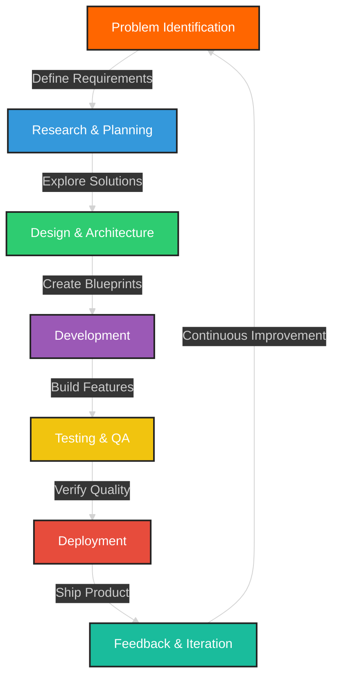

<!-- HEADER SECTION -->
<div align="center">
  

  <!-- Typing SVG -->
  <a href="https://converttools.site">
    
  </a>

  <div>
    <a href="https://converttools.site"></a>
    <a href="https://github.com/Mudassar52"></a>
    <a href="mailto:contact@converttools.site"></a>
    <a href="https://linkedin.com/in/mudassarlatif"></a>
    <a href="https://twitter.com/mudassarlatif"></a>
  </div>
</div>

<!-- ABOUT ME ANIMATED SECTION -->
<br>
<div align="center">
  
</div>

<!-- TECH STACK SECTION -->
<h2 align="center">
   
  Technology Arsenal
  
</h2>

<div align="center">
  <table>
    <tr>
      <td valign="top" width="33%">
        <h3 align="center">Frontend</h3>
        <div align="center">
          <a href="https://reactjs.org/" target="_blank"></a>
          <a href="https://nextjs.org/" target="_blank"></a>
          <a href="https://www.typescriptlang.org/" target="_blank"></a>
          <a href="https://www.javascript.com/" target="_blank"></a>
          <a href="https://tailwindcss.com/" target="_blank"></a>
          <a href="https://redux.js.org/" target="_blank"></a>
        </div>
      </td>
      <td valign="top" width="33%">
        <h3 align="center">Backend</h3>
        <div align="center">
          <a href="https://nodejs.org/" target="_blank"></a>
          <a href="https://expressjs.com/" target="_blank"></a>
          <a href="https://www.mongodb.com/" target="_blank"></a>
          <a href="https://www.postgresql.org/" target="_blank"></a>
          <a href="https://graphql.org/" target="_blank"></a>
          <a href="https://firebase.google.com/" target="_blank"></a>
        </div>
      </td>
      <td valign="top" width="33%">
        <h3 align="center">DevOps & Tools</h3>
        <div align="center">
          <a href="https://aws.amazon.com/" target="_blank"></a>
          <a href="https://www.docker.com/" target="_blank"></a>
          <a href="https://kubernetes.io/" target="_blank"></a>
          <a href="https://github.com/" target="_blank"></a>
          <a href="https://www.figma.com/" target="_blank"></a>
          <a href="https://www.python.org/" target="_blank"></a>
        </div>
      </td>
    </tr>
  </table>
</div>

<!-- 3D METRICS -->
<div align="center">
  <h2>
    
    My Contribution Graph
    
  </h2>
  
</div>

<!-- REAL-TIME STATS SECTION -->
<h2 align="center">
  
  GitHub Analytics
  
</h2>

<div align="center">
  
  
</div>

<div align="center">
  <h2>🔥 Streak Stats 🔥</h2>
  
</div>

<!-- CONVERTTOOLS SHOWCASE -->
<h2 align="center">
  
  ConvertTools.site Showcase
  
</h2>

<div align="center">
  <a href="https://converttools.site">
    
  </a>
</div>

<div align="center">
  <table>
    <tr>
      <td align="center" width="33%">
        
        <h3>Text Tools</h3>
        <p>Text case converters, formatters, counters, and encoders/decoders</p>
        <a href="https://converttools.site/text">
          
        </a>
      </td>
      <td align="center" width="33%">
        
        <h3>Image Tools</h3>
        <p>Image converters, optimizers, resizers, and special effects</p>
        <a href="https://converttools.site/image">
          
        </a>
      </td>
      <td align="center" width="33%">
        
        <h3>Data Tools</h3>
        <p>JSON/XML/CSV converters, validators, and data transformers</p>
        <a href="https://converttools.site/data">
          
        </a>
      </td>
    </tr>
    <tr>
      <td align="center" width="33%">
        
        <h3>Developer Tools</h3>
        <p>Code formatters, minifiers, and development utilities</p>
        <a href="https://converttools.site/dev">
          
        </a>
      </td>
      <td align="center" width="33%">
        
        <h3>Security Tools</h3>
        <p>Hash generators, password tools, and encryption utilities</p>
        <a href="https://converttools.site/security">
          
        </a>
      </td>
      <td align="center" width="33%">
        
        <h3>Web Tools</h3>
        <p>URL tools, HTML processors, and web utilities</p>
        <a href="https://converttools.site/web">
          
        </a>
      </td>
    </tr>
  </table>
</div>

<!-- PROJECT SHOWCASE -->
<h2 align="center">
  
  Featured Projects
  
</h2>

<div align="center">
  <a href="https://github.com/Mudassar52/converttools">
    
  </a>
  <a href="https://github.com/Mudassar52/portfolio">
    
  </a>
</div>

<!-- WORKFLOW SECTION -->
<h2 align="center">
  
  Development Philosophy
  
</h2>

<div align="center">
  


</div>

<!-- SERVICES SECTION -->
<h2 align="center">
  
  Professional Services
  
</h2>

<div align="center">
  <table>
    <tr>
      <td align="center" width="25%">
        
        <h3>Web Development</h3>
        <p>Full-stack solutions with React, Node.js, and more</p>
      </td>
      <td align="center" width="25%">
        
        <h3>API Development</h3>
        <p>REST/GraphQL APIs and third-party integrations</p>
      </td>
      <td align="center" width="25%">
        
        <h3>Cloud Solutions</h3>
        <p>AWS, Firebase, and scalable architectures</p>
      </td>
      <td align="center" width="25%">
        
        <h3>Performance Optimization</h3>
        <p>Speed up slow applications and websites</p>
      </td>
    </tr>
  </table>
</div>

<!-- ACTIVITY SECTION -->
<h2 align="center">
  
  Recent Activity
  
</h2>

<div align="center">
  
<!--RECENT_ACTIVITY:start-->
1. ⭐ Starred repository [reactjs/react](https://github.com/reactjs/react)
2. 🔄 Pushed 3 commits to [Mudassar52/converttools](https://github.com/Mudassar52/converttools)
3. 🎉 Merged PR #14 in [Mudassar52/converttools](https://github.com/Mudassar52/converttools)
4. 👀 Watched repository [vercel/next.js](https://github.com/vercel/next.js)
5. 🎭 Forked [tailwindlabs/tailwindcss](https://github.com/tailwindlabs/tailwindcss) to [Mudassar52/tailwindcss](https://github.com/Mudassar52/tailwindcss)
<!--RECENT_ACTIVITY:end-->

</div>

<!-- GITHUB METRICS -->
<h2 align="center">
  
  GitHub Metrics
  
</h2>

<div align="center">
  
</div>

<!-- SPOTIFY SECTION -->
<h2 align="center">
  
  Coding Soundtrack
  
</h2>

<div align="center">
  
</div>

<!-- CONTACT SECTION -->
<h2 align="center">
  
  Let's Connect
  
</h2>

<div align="center">
  <table>
    <tr>
      <td>
        <a href="https://calendly.com/mudassarlatif/30min" target="_blank">
          
        </a>
      </td>
      <td>
        <a href="https://twitter.com/messages/compose?recipient_id=mudassarlatif" target="_blank">
          
        </a>
      </td>
      <td>
        <a href="mailto:contact@converttools.site" target="_blank">
          
        </a>
      </td>
      <td>
        <a href="https://linkedin.com/in/mudassarlatif" target="_blank">
          
        </a>
      </td>
    </tr>
  </table>
</div>

<!-- VISITOR COUNTER -->
<div align="center">
  
  <h4>📅 Coding Since 2015 | 🌟 Support My Work by <a href="https://github.com/sponsors/Mudassar52">Sponsoring Me</a> 🌟</h4>
</div>

<!-- FOOTER -->


<!-- GitHub Fetcher Configuration -->
```yaml
# In .github/workflows/profile-3d.yml
name: GitHub 3D Profile
on:
  schedule:
    - cron: "0 0 * * *"
  workflow_dispatch:
jobs:
  build:
    runs-on: ubuntu-latest
    name: Update Profile 3D Contribution
    steps:
      - uses: actions/checkout@v3
      - uses: yoshi389111/github-profile-3d-contrib@0.7.1
        env:
          GITHUB_TOKEN: ${{ secrets.GITHUB_TOKEN }}
          USERNAME: ${{ github.repository_owner }}
      - name: Commit & Push
        run: |
          git config user.name github-actions
          git config user.email github-actions@github.com
          git add -A .
          git commit -m "Updated 3D Contrib" || exit 0
          git push

# In .github/workflows/snake.yml
name: Generate Snake
on:
  schedule:
    - cron: "0 0 * * *"
  workflow_dispatch:
jobs:
  build:
    runs-on: ubuntu-latest
    steps:
      - uses: actions/checkout@v3
      - uses: Platane/snk@master
        id: snake-gif
        with:
          github_user_name: Mudassar52
          svg_out_path: dist/github-contribution-grid-snake-dark.svg
          snake_color: 'blue'
      - uses: crazy-max/ghaction-github-pages@v3.1.0
        with:
          target_branch: output
          build_dir: dist
        env:
          GITHUB_TOKEN: ${{ secrets.GITHUB_TOKEN }}

# In .github/workflows/update-readme.yml
name: Update README
on:
  schedule:
    - cron: "0 0 * * *"
  workflow_dispatch:
jobs:
  build:
    runs-on: ubuntu-latest
    name: Update Profile README
    steps:
      - uses: actions/checkout@v3
      - uses: jamesgeorge007/github-activity-readme@master
        env:
          GITHUB_TOKEN: ${{ secrets.GITHUB_TOKEN }}
      - uses: gautamkrishnar/blog-post-workflow@master
        with:
          feed_list: "https://converttools.site/feed.xml"
          max_post_count: 5
      - uses: kittinan/spotify-github-profile@master
        with:
          spotify_client_id: ${{ secrets.SPOTIFY_CLIENT_ID }}
          spotify_client_secret: ${{ secrets.SPOTIFY_CLIENT_SECRET }}
          spotify_refresh_token: ${{ secrets.SPOTIFY_REFRESH_TOKEN }}
```
