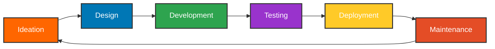

<div align="center">
  
# Mudassar Latif

<a href="https://converttools.site"></a>
<a href="https://github.com/Mudassar52"></a>
<a href="https://linkedin.com/in/mudassarlatif"></a>

</div>

<div align="center">
  
  
</div>

<div align="center">
  
## `{ Full-Stack Developer & Digital Craftsman }`

</div>

<table align="center">
  <tr>
    <td width="50%" valign="top">
      <h3 align="center">🧠 Skills & Expertise</h3>
      <div align="center">
        
        
        
        
        
        
        
        
        
        
        
        
      </div>
      <br>
      <h3 align="center">🛠 Projects & Work</h3>
      <div align="center">
        <a href="https://github.com/Mudassar52/converttools">
          
        </a>
        <br><br>
        <a href="https://github.com/Mudassar52/portfolio">
          
        </a>
      </div>
    </td>
    <td width="50%" valign="top">
      <h3 align="center">📊 Stats & Activity</h3>
      <p align="center">
        
      </p>
      <div align="center">
        
      </div>
      <br>
      <h3 align="center">⚡ Current Focus</h3>
      <div align="center">
        
        
        
      </div>
    </td>
  </tr>
</table>

<div align="center">
  
## 🔄 My Development Workflow



</div>

<div align="center">
  
## 🧰 My Services
  
</div>

<table>
  <tr>
    <td align="center" width="33%">
      <br>
      Full-stack solutions with modern JavaScript frameworks and scalable backend services
    </td>
    <td align="center" width="33%">
      <br>
      Custom web tools and utilities for specific business needs and productivity enhancement
    </td>
    <td align="center" width="33%">
      <br>
      Seamless integration of third-party services and development of custom API solutions
    </td>
  </tr>
</table>

<div align="center">
  
## 📈 Contribution Calendar

</div>


<div align="center">
  
## 🗂 Recent Projects on [ConvertTools.site](https://converttools.site)

</div>

<table>
  <tr>
    <td width="33%" align="center">
      <h3>📝 Text Tools</h3>
      
      <p>Powerful utilities for text conversion and manipulation</p>
    </td>
    <td width="33%" align="center">
      <h3>🖼 Image Tools</h3>
      
      <p>Convert, compress and edit images with ease</p>
    </td>
    <td width="33%" align="center">
      <h3>📊 Data Tools</h3>
      
      <p>Format and transform data between various formats</p>
    </td>
  </tr>
</table>

<div align="center">
  
## 📫 Connect With Me
  
<a href="mailto:contact@converttools.site"></a>
<a href="https://twitter.com/mudassarlatif"></a>
<a href="https://calendly.com/mudassarlatif"></a>
  
</div>

<div align="center">
  
## 🎯 GitHub Achievements
  

  
</div>

<details>
  <summary><b>💡 More About Me</b></summary>
  <br>
  
  - 🌐 Creator of [ConvertTools.site](https://converttools.site) - a platform with free online utilities
  - 🔭 Working on expanding my digital tools ecosystem
  - 🌱 Currently enhancing my skills in cloud architecture and Web3
  - 👨‍💻 All of my projects are available at [github.com/Mudassar52](https://github.com/Mudassar52)
  - 📫 Reach me at contact@converttools.site
  - ⚡ Fun fact: I automate everything I can in my workflow

</details>

<div align="center">
  
  
  ### 🙏 Thanks for visiting my GitHub profile!
</div>

<!-- GitHub Actions workflow for automatic README updates -->
```yaml
# In .github/workflows/update-profile-readme.yml
name: Update Profile README

on:
  schedule:
    - cron: '0 0 * * *'
  workflow_dispatch:

jobs:
  update-readme:
    name: Update Profile README
    runs-on: ubuntu-latest
    steps:
      - uses: actions/checkout@v3
      - uses: jamesgeorge007/github-activity-readme@master
        env:
          GITHUB_TOKEN: ${{ secrets.GITHUB_TOKEN }}
      - uses: athul/waka-readme@master
        with:
          WAKATIME_API_KEY: ${{ secrets.WAKATIME_API_KEY }}
      - uses: Mudassar52/github-readme-stats-action@main
        with:
          GH_TOKEN: ${{ secrets.GH_TOKEN }}
      - uses: Platane/snk@master
        with:
          github_user_name: Mudassar52
          gif_out_path: dist/github-snake.gif
      - uses: EndBug/add-and-commit@v9
        with:
          message: 'Update README with latest data'
          add: '*.md *.gif'
```  
