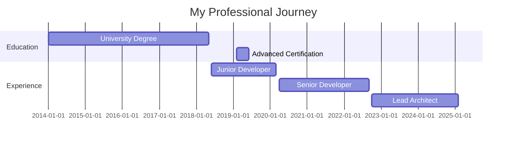

<h1 align="center">
  <a href="https://github.com/Mudassar52">
    
  </a>
</h1>

<p align="center">
  <a href="https://yourdomain.com"></a>
  <a href="https://linkedin.com/in/yourusername"></a>
  <a href="https://twitter.com/yourusername"></a>
  <a href="mailto:your.email@example.com"></a>
</p>

<div align="center">
  
</div>

<!-- Custom SVG Waves -->


##  About Me

> "The future belongs to those who believe in the beauty of their dreams." - Eleanor Roosevelt

<details>
<summary>💭 Click to reveal my professional journey</summary>
<br>



</details>

<details>
<summary>🧠 Tech knowledge profile</summary>
<br>

<table align="center">
  <tr>
    <td align="center" width="96">
      
      <br>JavaScript
    </td>
    <td align="center" width="96">
      
      <br>TypeScript
    </td>
    <td align="center" width="96">
      
      <br>React
    </td>
    <td align="center" width="96">
      
      <br>Nginx
    </td>
    <td align="center" width="96">
      
      <br>Python
    </td>
  </tr>
  <tr>
    <td align="center" width="96">
      
      <br>AWS
    </td>
    <td align="center" width="96">
      
      <br>GitHub
    </td>
    <td align="center" width="96">
      
      <br>Docker
    </td>
    <td align="center" width="96">
      
      <br>Kubernetes
    </td>
    <td align="center" width="96">
      
      <br>MySQL
    </td>
  </tr>
</table>
</details>

<details>
<summary>🌟 Core competencies</summary>
<br>

```elixir
defmodule Developer do
  def identity do
    %{
      name: "Your Name",
      title: "Full Stack Developer & System Architect",
      location: "City, Country",
      available_for_hire: true
    }
  end

  def core_skills do
    [
      %{category: "Languages", skills: ["TypeScript", "Python", "Rust", "Go", "Elixir"]},
      %{category: "Frontend", skills: ["React", "Next.js", "Vue", "Svelte", "WebGL"]},
      %{category: "Backend", skills: ["Node.js", "Django", "Spring Boot", "GraphQL", "gRPC"]},
      %{category: "DevOps", skills: ["Docker", "Kubernetes", "Terraform", "Github Actions", "AWS"]}
    ]
  end

  def current_focus do
    [
      "Building high-performance distributed systems",
      "Implementing AI-driven development workflows",
      "Contributing to open source projects",
      "Mentoring junior developers"
    ]
  end
end
```
</details>

##  Featured Projects

<div align="center">
<a href="https://github.com/yourusername/project1">
  
</a>
<a href="https://github.com/yourusername/project2">
  
</a>
</div>

##  Github Stats

<div align="center">
  <details>
  <summary>📊 Contribution Graph</summary>
  <br>
  
  </details>

  <details>
  <summary>🏆 GitHub Trophies</summary>
  <br>
  
  </details>

  
  
  
</div>

##  Let's Connect

<p align="center">
  <i>I'm always open to interesting conversations and collaboration.</i>
</p>

<p align="center">
  <a href="https://yourdomain.com/contact">
    
  </a>
</p>

##  Current Status

```yaml
Currently:
  Working_on: "Building a scalable microservice architecture"
  Learning: "Rust and WebAssembly"
  Looking_for: "Open source projects to contribute to"
  Reading: "Clean Architecture by Robert C. Martin"
```

<!-- Custom SVG Waves -->


<!-- Hidden Markdown for adding your GitHub Actions workflow for the snake animation -->
<!-- 
To enable the snake animation:
1. Create .github/workflows/snake.yml with the following content:

name: Generate Snake Animation

on:
  schedule:
    - cron: "0 */12 * * *"
  workflow_dispatch:

jobs:
  build:
    runs-on: ubuntu-latest
    steps:
      - uses: actions/checkout@v2
      - uses: Platane/snk@master
        id: snake-gif
        with:
          github_user_name: yourusername
          svg_out_path: dist/github-contribution-grid-snake.svg
      - uses: crazy-max/ghaction-github-pages@v2.1.3
        with:
          target_branch: output
          build_dir: dist
        env:
          GITHUB_TOKEN: ${{ secrets.GITHUB_TOKEN }}
-->
